<div align="center">

# 👋 Hey there, I'm Rohit!


<p align="center">
  <a href="https://www.linkedin.com/in/rohitk2004"></a>
  <a href="mailto:rohitkumargpta585@gmail.com"></a>
  <a href="https://github.com/rohitk2004"></a>
</p>

</div>

---

## 🚀 About Me

```typescript
const Rohit = {
  role: "Hybrid Digital Professional",
  experience: "3+ Years",
  location: "India 🇮🇳",

  expertise: {
    development: ["PHP", "Python", "JavaScript", "WordPress"],
    marketing: ["SEO (White & Black Hat)", "Google Ads", "Meta Ads"],
    focus: "Converting traffic into revenue 💰",
  },

  currentlyLearning: ["Advanced SEO Automation", "AI Integration"],
  funFact: "I debug code by day, optimize rankings by night 🌙",

  motto: "Coding the engine, Marketing the fuel 🚀",
};
```

<div align="center">

## 🛠️ My Tech Arsenal

### 💻 Development Stack


### 📊 Marketing & Analytics


</div>

---

<div align="center">

## 📊 GitHub Statistics


</div>

---

<div align="center">

## 🏆 GitHub Trophies

[](https://github.com/ryo-ma/github-profile-trophy)

</div>

---

## 💼 What I Bring to the Table

<table>
<tr>
<td width="50%">

### 🌐 Web Development

- ✅ **Custom WordPress** themes & plugins
- ✅ **Scalable web apps** with PHP & Python
- ✅ **E-commerce solutions** that convert
- ✅ **Performance optimization** for speed
- ✅ **Responsive design** across all devices

</td>
<td width="50%">

### 📈 Digital Marketing

- ✅ **SEO strategies** (White & Black Hat)
- ✅ **Google & Meta Ads** campaigns
- ✅ **Data-driven** decision making
- ✅ **Conversion rate optimization**
- ✅ **Revenue scaling** through ads

</td>
</tr>
</table>

---

<div align="center">

## 🎯 Current Focus

```mermaid
graph LR
    A[Code] --> B[Build]
    B --> C[Optimize]
    C --> D[Market]
    D --> E[Scale]
    E --> F[💰 Revenue]

    style A fill:#00F2FF,stroke:#fff,stroke-width:2px,color:#000
    style B fill:#4C9AFF,stroke:#fff,stroke-width:2px,color:#000
    style C fill:#0052CC,stroke:#fff,stroke-width:2px,color:#fff
    style D fill:#FF6B6B,stroke:#fff,stroke-width:2px,color:#fff
    style E fill:#FFA500,stroke:#fff,stroke-width:2px,color:#000
    style F fill:#00FF00,stroke:#fff,stroke-width:2px,color:#000
```



🔭 **Working on:** Building automated SEO tools  
🌱 **Learning:** AI-powered marketing automation  
💬 **Ask me about:** PHP, Python, SEO, or how to scale digital products  
⚡ **Fun fact:** I've ranked websites from 0 to 100K+ visitors in under 6 months

</div>

---

<div align="center">

## 📫 Let's Build Something Amazing Together!

<a href="https://www.linkedin.com/in/rohitk2004">
  
</a>
<a href="mailto:rohitkumargpta585@gmail.com">
  
</a>
<a href="https://github.com/rohitk2004">
  
</a>

---

### ⭐ _"In the intersection of code and marketing, magic happens."_ ✨


</div>
