[;💰+Scaling+Revenue+with+Paid+Ads;⚡+WordPress+Development+Expert;🚀+3%2B+Years+Turning+Code+into+Revenue>)](https://git.io/typing-svg)

  
  
  

  
  
  

---

## 🎯 Who Am I?

> **"Converting code into revenue"** 💸

**👨‍💻 Name:** Rohit Kumar  
**📍 Location:** India 🇮🇳  
**💼 Role:** Full-Stack Dev + SEO Specialist  
**⚡ Experience:** 3+ Years

**🚀 Current Mission:**

- 🔨 Building Automated SEO Tools
- 🤖 Integrating AI into Marketing
- 💰 Scaling Digital Products to 6-Figures
- 📚 Mastering Full-Stack + Growth Hacking

 

---

## 🛠️ Tech Arsenal & Marketing Stack

### 💻 Development Technologies

<table>
<tr>
<td align="center" width="100">

 PHP
</td>
<td align="center" width="100">

 Python
</td>
<td align="center" width="100">

 JavaScript
</td>
<td align="center" width="100">

 HTML5
</td>
<td align="center" width="100">

 CSS3
</td>
<td align="center" width="100">

 WordPress
</td>
<td align="center" width="100">

 React
</td>
<td align="center" width="100">

 Node.js
</td>
</tr>
</table>

### 🗄️ Databases & DevOps

<table>
<tr>
<td align="center" width="100">

 MySQL
</td>
<td align="center" width="100">

 PostgreSQL
</td>
<td align="center" width="100">

 Redis
</td>
<td align="center" width="100">

 MongoDB
</td>
<td align="center" width="100">

 Git
</td>
<td align="center" width="100">

 Docker
</td>
<td align="center" width="100">

 Linux
</td>
<td align="center" width="100">

 AWS
</td>
</tr>
</table>

### 📊 Marketing & Analytics Platforms

---

## 📊 GitHub Analytics & Performance

---

## 💼 My Dual Expertise

<table>
<tr>
<td width="50%" valign="top">

### 🌐 Web Development Mastery

**Core Skills:**

- ✅ Custom WordPress Development (Themes & Plugins)
- ✅ Scalable Web Applications (PHP, Python)
- ✅ E-commerce Solutions with WooCommerce
- ✅ RESTful API Development & Integration
- ✅ Database Design & Optimization
- ✅ Performance Tuning (Page Speed < 2s)
- ✅ Responsive UI/UX Design
- ✅ Server Management (Linux, Nginx, Apache)

**Recent Projects:**

- 🚀 SEO Analysis Tool (FastAPI + Redis)
- 🚀 Lead Scraper with Streamlit UI
- 🚀 E-commerce Platform (WooCommerce)
- 🚀 Automated Marketing Dashboard

</td>
<td width="50%" valign="top">

### 📈 Digital Marketing Excellence

**SEO Expertise:**

- ✅ White Hat SEO (Sustainable Growth)
- ✅ Black Hat SEO (Aggressive Strategies)
- ✅ Technical SEO Audits
- ✅ On-Page & Off-Page Optimization
- ✅ Link Building Campaigns
- ✅ Keyword Research & Strategy

**Paid Advertising:**

- 💰 Google Ads (Search, Display, Shopping)
- 💰 Meta Ads (Facebook & Instagram)
- 💰 PPC Campaign Management
- 💰 Conversion Rate Optimization (CRO)
- 💰 A/B Testing & Analytics

**Key Results:**

- 📈 0 → 100K+ monthly visitors in 6 months
- 📈 Generated $500K+ in ad revenue for clients
- 📈 Achieved 300%+ ROI on campaigns

</td>
</tr>
</table>

---

## 🎯 My Workflow & Process

```mermaid
graph LR
    A[💡 Idea] --> B[📋 Plan]
    B --> C[💻 Code]
    C --> D[🧪 Test]
    D --> E[⚡ Optimize]
    E --> F[🚀 Deploy]
    F --> G[📊 Analyze]
    G --> H[📢 Market]
    H --> I[💰 Scale]
    I --> J[🎉 Revenue!]

    style A fill:#E100FF,stroke:#fff,stroke-width:3px,color:#fff
    style B fill:#C724B1,stroke:#fff,stroke-width:3px,color:#fff
    style C fill:#AD49B2,stroke:#fff,stroke-width:3px,color:#fff
    style D fill:#936DB3,stroke:#fff,stroke-width:3px,color:#fff
    style E fill:#7992B4,stroke:#fff,stroke-width:3px,color:#fff
    style F fill:#5FB6B5,stroke:#fff,stroke-width:3px,color:#000
    style G fill:#45DAB6,stroke:#fff,stroke-width:3px,color:#000
    style H fill:#2BFFB7,stroke:#fff,stroke-width:3px,color:#000
    style I fill:#00D9FF,stroke:#fff,stroke-width:3px,color:#000
    style J fill:#00FF88,stroke:#fff,stroke-width:3px,color:#000
```

---

## 🔥 Currently Working On

| Project                       | Tech Stack                | Status         | Description                              |
| ----------------------------- | ------------------------- | -------------- | ---------------------------------------- |
| 🤖 AI SEO Automation Tool     | Python, FastAPI, OpenAI   | 🟢 Active      | Automating content optimization with AI  |
| 📈 Growth Analytics Dashboard | React, Python, PostgreSQL | 🟡 In Progress | Real-time marketing analytics platform   |
| 💰 Revenue Tracker            | WordPress, PHP, MySQL     | 🟢 Active      | E-commerce revenue attribution system    |
| 🎯 Lead Generation Bot        | Python, Selenium, APIs    | 🔵 Planning    | Automated B2B lead scraping & enrichment |

---

## 📚 Latest Achievements & Milestones

- 🎯 Scaled 5+ websites to 100K+ monthly visitors
- 💰 Generated $500K+ in ad revenue for clients
- 🚀 Built 50+ custom WordPress themes & plugins
- 📈 Achieved #1 Google rankings for 200+ keywords
- 🤝 Worked with 30+ businesses across 10 industries
- ⚡ Optimized page speeds to <2s load time
- 🔥 10,000+ hours of coding experience
- 💡 Created automated systems saving 100+ hours/month

---

## 💬 What Drives Me

### 🎯 My Philosophy

> **"The best code is useless if no one sees it. The best marketing falls flat without a solid product."**

I bridge the gap between **clean code** and **high-performance marketing**. While developers focus on features and marketers focus on campaigns, I optimize both ends:

- 💻 **Build** → Scalable, fast, SEO-friendly applications
- 📊 **Measure** → Data-driven decisions using analytics
- 🚀 **Grow** → Aggressive SEO & paid ad strategies
- 💰 **Monetize** → Revenue-focused optimization

---

## 🌐 Let's Connect & Collaborate!

  

### � Open for:

- 🤝 Freelance Projects (Web Dev + SEO)
- 💻 Full-Stack Development Opportunities
- 📈 Marketing Consultation & Growth Hacking
- 🚀 Collaborative Ventures in SaaS

 

### ⭐ If you like my work, consider starring my repositories!

**💡 "In the intersection of code and marketing, magic happens." ✨**

